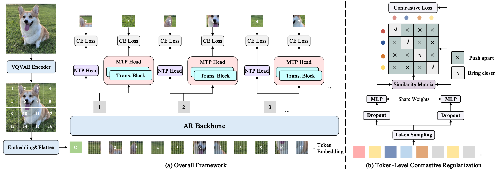

# Efficient Training with Foresight: Multi-Token Auxiliary Supervision for Autoregressive Image Generation

Official PyTorch implementation of **MTAR**, accepted by ACM Multimedia 2026.



MTAR improves autoregressive image generation with three training-time components:

- **Multi-Token Prediction (MTP):** adds future-token supervision beyond next-token prediction.
- **Token-level Contrastive Regularization (TCR):** regularizes token representations with two dropout views.
- **Semantic Dropping (SD):** uses offline DINOv3 scores to retain informative visual tokens during training.

All auxiliary components are removed at inference time, so sampling follows the standard LlamaGen autoregressive path.

## Results on ImageNet 256x256

| Model | Parameters | FID | IS | Precision | Recall |
|---|---:|---:|---:|---:|---:|
| LlamaGen-B | 111M | 5.46 | 193.61 | 0.84 | 0.46 |
| **MTAR-B** | 138M | **4.50** | **213.96** | **0.84** | **0.48** |
| LlamaGen-L | 343M | 3.80 | 248.28 | 0.83 | 0.52 |
| **MTAR-L** | 387M | **2.85** | **271.41** | **0.83** | **0.54** |

At 300 epochs, MTAR-B and MTAR-L provide 1.27x and 1.39x training speedups, respectively.

## Setup

Use a [LlamaGen](https://github.com/FoundationVision/LlamaGen)-compatible PyTorch environment. DINOv3 preprocessing additionally requires a recent version of `transformers`. Download the ImageNet dataset and the LlamaGen VQ-16 tokenizer checkpoint before training.

## Data preparation

Extract aligned VQ tokens, labels, and DINOv3 semantic scores:

```bash
CUDA_VISIBLE_DEVICES=0,1 bash dinov3/extract_dinov3_scores.sh \
    /path/to/imagenet/train \
    /path/to/imagenet256_features \
    /path/to/vq_ds16_c2i.pt
```

The output directory contains:

```text
imagenet256_features/
├── imagenet256_codes/
├── imagenet256_labels/
└── imagenet256_scores/
```

## Training

The default launcher trains MTAR-B for 300 epochs with 50% semantic dropping during the first 80% of training, followed by full-token training during the last 20%.

```bash
CUDA_DEVICES=0 bash train_c2i_mtar.sh \
    /path/to/imagenet256_features \
    /path/to/results
```

The launcher enables EMA and `torch.compile` and uses the main paper settings. Other settings can be changed directly in `train_c2i_mtar.sh`.

## Sampling and evaluation

Generate 50,000 samples:

```bash
CUDA_VISIBLE_DEVICES=0 bash sample_c2i_mtar.sh \
    /path/to/mtar_checkpoint.pt \
    /path/to/vq_ds16_c2i.pt \
    2.0 \
    ./fid_samples \
    50000
```

Evaluate the generated NPZ file:

```bash
EVAL_CONDA_ENV=lla bash evaluate_c2i_mtar.sh \
    /path/to/VIRTUAL_imagenet256_labeled.npz \
    /path/to/generated_samples.npz
```

## Citation

```bibtex
@inproceedings{niu2026mtar,
  title     = {Efficient Training with Foresight: Multi-Token Auxiliary Supervision for Autoregressive Image Generation},
  author    = {Niu, Guo and Yao, Xiongfei and Wang, Teng and Zhu, Nannan},
  
  year      = {2026},
 
}
```

## Acknowledgements

This repository is built on [LlamaGen](https://github.com/FoundationVision/LlamaGen). We thank the authors for releasing their code and models.
